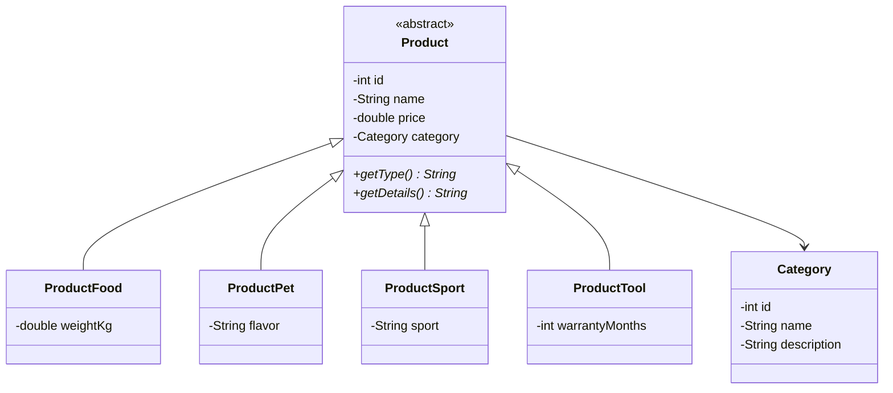

# 🛒 TechLab - Sistema de Gestión de Productos

Aplicación de consola desarrollada en **Java** que implementa un **CRUD de productos** (Crear, Leer, Actualizar y Eliminar), con categorías predefinidas y distintos tipos de producto modelados mediante **herencia y polimorfismo**.

## 📋 Características

- Alta de productos de 4 tipos distintos: alimentos, mascotas, deportes y herramientas.
- Listado de todos los productos cargados.
- Búsqueda de un producto por ID.
- Modificación de productos (datos generales y datos específicos según su tipo).
- Eliminación de productos por ID.
- Listado de categorías disponibles.
- Validación de entradas por consola (números válidos, valores no negativos y textos no vacíos).
- Generación automática de IDs incrementales para productos y categorías.

## 🧰 Tecnologías y requisitos

- **Java 17** o superior (se utilizan *switch expressions* con `yield` y *pattern matching* para `instanceof`, que requieren como mínimo Java 16).
- Ninguna librería externa: solo la biblioteca estándar de Java.

## 📁 Estructura del proyecto

```
src/main/java/com/techlab/product/
├── App.java                  # Punto de entrada: menú y lógica del CRUD
└── model/
    ├── Category.java         # Categoría de producto
    ├── Product.java          # Clase abstracta base de todos los productos
    ├── ProductFood.java      # Producto alimenticio (peso en kg)
    ├── ProductPet.java       # Producto para mascotas (sabor)
    ├── ProductSport.java     # Producto deportivo (deporte)
    └── ProductTool.java      # Herramienta (meses de garantía)
```

## 🧩 Modelo de clases



| Clase | Atributo específico | Tipo mostrado | Detalle mostrado |
|-------|---------------------|---------------|------------------|
| `ProductFood` | `weightKg` | Alimentos | `Peso: X kg` |
| `ProductPet` | `flavor` | Mascotas | `Sabor: X` |
| `ProductSport` | `sport` | Deportes | `Deporte: X` |
| `ProductTool` | `warrantyMonths` | Herramientas | `Garantía: X meses` |

`Product` define los métodos abstractos `getType()` y `getDetails()`, que cada subclase implementa. De esta forma, `toString()` se resuelve de manera polimórfica y el listado funciona igual para cualquier tipo de producto.

## 🏷️ Categorías predefinidas

Al iniciar la aplicación se cargan 4 categorías:

| ID | Nombre | Descripción |
|----|--------|-------------|
| 1 | Alimentos | Productos y bebidas para el consumo diario |
| 2 | Mascotas | Productos alimenticios para el cuidado de mascotas |
| 3 | Deportes | Artículos y accesorios para actividades deportivas y recreativas |
| 4 | Herramientas | Herramientas y accesorios para trabajos de reparación y mantenimiento |

## ▶️ Cómo ejecutar el proyecto

### Opción 1: desde un IDE

1. Clonar el repositorio:
   ```bash
   git clone https://github.com/emmanuel-cruz-dev/preentrega-emmanuel-cruz-C26223.git
   ```
2. Abrir el proyecto en IntelliJ IDEA, Eclipse, VS Code o el IDE de preferencia.
3. Ejecutar la clase `com.techlab.product.App`.

### Opción 2: desde la terminal

Ubicado en la raíz del proyecto:

**Linux / macOS**
```bash
mkdir -p out
javac -d out $(find src -name "*.java")
java -cp out com.techlab.product.App
```

**Windows (PowerShell)**
```powershell
mkdir out
javac -d out (Get-ChildItem -Recurse -Filter *.java src).FullName
java -cp out com.techlab.product.App
```

## 🖥️ Uso

Al ejecutar la aplicación se muestra el siguiente menú:

```
======================================================
 SISTEMA DE GESTIÓN - TECHLAB
======================================================
1 - Agregar producto
2 - Listar productos
3 - Buscar producto
4 - Modificar producto
5 - Eliminar producto
6 - Listar categorías
0 - Salir
======================================================
Ingrese una opción:
```

### Descripción de las opciones

| Opción | Acción |
|--------|--------|
| **1** | Solicita el tipo de producto, nombre, precio, categoría y el dato específico del tipo elegido. |
| **2** | Muestra todos los productos cargados en formato de tabla. |
| **3** | Busca un producto por su ID y muestra su información. |
| **4** | Permite cambiar nombre, precio, categoría y el dato específico del producto. |
| **5** | Elimina un producto a partir de su ID. |
| **6** | Muestra las categorías disponibles con su ID. |
| **0** | Cierra la aplicación. |

### Ejemplo de alta de producto

```
--- INGRESAR PRODUCTO ---
1 - Producto alimenticio
2 - Producto para mascotas
3 - Producto deportes
4 - Producto Herramientas
Seleccione el tipo de producto: 1
Ingrese el nombre del producto: Arroz
Ingrese el precio del producto: 1500.50
...
Ingrese el ID de la categoría: 1
Ingrese el peso del producto: 1
Producto ingresado correctamente. Resumen:
| 1    | Arroz                | $1500.50   | Alimentos    | Peso:1.0kg                |
```

## ✅ Validaciones

- Las opciones numéricas rechazan texto y vuelven a pedir el dato.
- Los precios y pesos no pueden ser negativos.
- Los textos (nombre, sabor, deporte) no pueden estar vacíos.
- Solo se pueden asignar categorías existentes.
- Buscar, modificar o eliminar un producto con un ID inexistente muestra un mensaje de error.

## ⚠️ Consideraciones

- **Los datos se guardan solo en memoria** (`ArrayList`): al cerrar la aplicación se pierden los productos cargados.
- Los IDs se generan con un contador estático, por lo que **no se reutilizan** al eliminar un producto.

## 🚀 Posibles mejoras

- Persistencia de datos (archivos, base de datos con JDBC o JPA).
- Alta, modificación y baja de categorías.
- Búsqueda por nombre o filtrado por categoría.
- Gestión de stock.
- Tests unitarios con JUnit.
- Migración a un proyecto Maven o Gradle.

## 👤 Autor

**Emmanuel Cruz**  
Proyecto desarrollado como práctica del curso **Backend** Java de **Talento Tech**.
